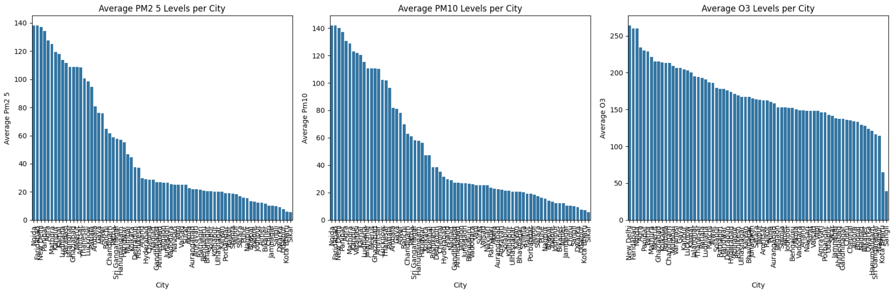

# AQI & Weather Analysis — India

> **Exploratory and statistical analysis of air quality and weather data across 74 Indian cities, examining how meteorological variables influence pollutant concentrations.**

---

## Table of Contents

1. [Objective](#objective)
2. [Dataset](#dataset)
3. [Project Structure](#project-structure)
4. [Tech Stack](#tech-stack)
5. [Methodology](#methodology)
6. [Results](#results)
    - [6.1 Data Cleaning and Validation](#1-data-cleaning-and-validation)
    - [6.2 Exploratory Data Analysis](#2-exploratory-data-analysis)
    - [6.3 Statistical Analysis](#3-statistical-analysis)
7. [Key Findings](#key-findings)
8. [Limitations and Future Work](#limitations-and-future-work)
9. [Notebook Guide](#notebook-guide)
10. [How to Run](#how-to-run)

---

## Objective

Analyze how weather variables (temperature, humidity, wind speed, precipitation) influence air pollution concentrations (PM2.5, PM10, CO, NO2, O3, SO2) across Indian cities. The goal is to identify statistically significant relationships between meteorological conditions and pollutant levels and to reveal city-level patterns in air quality across India.

---

## Dataset

| Property | Details |
|---|---|
| **Source** | Kaggle — `indian_weather_data.csv` |
| **Coverage** | 74 Indian cities (single-snapshot observations) |
| **Total columns (raw)** | 25 |
| **Columns after cleaning** | 12 |
| **Missing values** | None — fully complete dataset |

### Raw Variables (25 columns)

The raw dataset covered: city name, latitude/longitude, temperature, weather code, sunrise/sunset times, moonrise/moonset times, CO, NO2, O3, SO2, PM2.5, PM10, wind speed, wind degree, wind direction, pressure, precipitation, humidity, cloud cover, feels-like temperature, UV index, and visibility.

### Cleaned Variables (12 columns retained)

| Column | Type | Description |
|---|---|---|
| `city` | object | City name |
| `co` | float64 | Carbon monoxide concentration |
| `no2` | float64 | Nitrogen dioxide concentration |
| `o3` | int64 | Ozone concentration |
| `so2` | float64 | Sulfur dioxide concentration |
| `pm2_5` | float64 | Fine particulate matter (≤2.5µm) |
| `pm10` | float64 | Coarse particulate matter (≤10µm) |
| `temperature` | int64 | Ambient temperature (°C) |
| `humidity` | int64 | Relative humidity (%) |
| `wind_speed` | int64 | Wind speed (km/h) |
| `uv_index` | int64 | UV index |
| `precip` | float64 | Precipitation (mm) |

---

## Project Structure

```
air-quality-weather-analysis/
│
├── data/
│   ├── indian_weather_data.csv          # Raw dataset
│   └── cleaned_air_quality_weather.csv  # Cleaned dataset (output of NB1)
│
├── notebooks/
│   ├── 01_data_cleaning.ipynb           # Data loading, inspection, cleaning
│   ├── 02_exploratory_analysis.ipynb    # EDA, city rankings, heatmaps, pairplots
│   └── 03_statistical_analysis.ipynb    # Pearson correlations, hypothesis tests, distributions
│
├── images/                              # Saved plots from notebooks
├── requirements.txt
└── README.md
```

---

## Tech Stack

| Library | Purpose |
|---|---|
| `pandas` | Data loading, cleaning, groupby aggregations |
| `numpy` | Numerical operations |
| `matplotlib` | Bar plots, histograms, scatter plots |
| `seaborn` | Heatmaps, boxplots, pairplots |
| `scipy.stats` | Pearson correlation with p-values |
| Google Colab | Execution environment |

---

## Methodology

The analysis was structured across three notebooks, each building on the previous:

1. **Data Cleaning** — Load raw data, inspect schema and data types, verify completeness, select relevant columns, export clean CSV.
2. **Exploratory Data Analysis** — Summary statistics, city-level bar charts, correlation heatmap, pairplot of all pollutants, top-ranked cities per pollutant.
3. **Statistical Analysis** — Descriptive statistics for all features, Pearson correlation significance testing across pollutant–weather pairs, distribution visualizations, scatter plots for strongest correlations, box plots of pollutant distributions by city, weather profiling of the most polluted cities.

---

## Results

### 1. Data Cleaning and Validation

#### 1.1 Dataset Overview

The raw dataset contained **74 rows × 25 columns**. All 74 entries were non-null across every column — no imputation or row-dropping was required. The dataset represents a **single time-snapshot** of weather and air quality readings across 74 Indian cities.

Memory usage of the raw DataFrame: **14.6+ KB**.

Data types breakdown:
- 8 `float64` columns (pollutants and precipitation)
- 11 `int64` columns (temperature, wind, UV, etc.)
- 6 `object` columns (city name, wind direction, sunrise/sunset, moonrise/moonset)

#### 1.2 Sample Raw Readings (Top 5 Cities)

| City | CO | NO2 | O3 | SO2 | PM2.5 | PM10 | Temp (°C) | Humidity (%) | Wind (km/h) |
|---|---|---|---|---|---|---|---|---|---|
| New Delhi | 1411.85 | 23.95 | 264 | 76.65 | 137.25 | 140.05 | 21 | 53 | 4 |
| Mumbai | 644.85 | 25.55 | 209 | 31.15 | 46.65 | 47.05 | 30 | 35 | 18 |
| Kolkata | 457.85 | 1.95 | 214 | 12.95 | 44.55 | 47.25 | 21 | 73 | 8 |
| Chennai | 275.85 | 2.05 | 135 | 7.55 | 28.75 | 35.15 | 26 | 65 | 19 |
| Bengaluru | 243.85 | 3.85 | 152 | 10.75 | 20.95 | 26.35 | 24 | 25 | 9 |

Even from the first 5 rows, the pattern is stark: New Delhi's PM2.5 (137.25) is approximately **6.5× higher** than Bengaluru (20.95) and **4.8× higher** than Mumbai (46.65).

#### 1.3 Columns Dropped

13 columns were dropped from the raw dataset that were not relevant to pollutant–weather correlation analysis: `lat`, `lon`, `weather_code`, `sunrise`, `sunset`, `moonrise`, `moonset`, `wind_degree`, `wind_dir`, `pressure`, `cloudcover`, `feelslike`, `visibility`.

#### 1.4 City-wise Box Plots (Pollutant Distributions)

Box plots were generated for all six pollutants (CO, NO2, O3, SO2, PM2.5, PM10) across all 74 cities. Key observations:

- **CO**: Extreme right skew with northern cities (Amritsar, Delhi, Noida) showing values 8–12× the median
- **NO2**: Notably bimodal — most cities clustered below 10, with Mumbai and Delhi as clear outliers at ~24–25
- **O3**: Most cities fall in a tighter range (140–200), but Delhi, Faridabad, and Noida form a high-O3 cluster around 260–264
- **SO2**: Right-skewed, with New Delhi at 76.65 standing out against the median of ~19.85
- **PM2.5 / PM10**: Near-identical distributions, heavily skewed by the NCR cluster

---

### 2. Exploratory Data Analysis

#### 2.1 Descriptive Statistics  Pollutants

| Statistic | CO | NO2 | O3 | SO2 | PM2.5 | PM10 |
|---|---|---|---|---|---|---|
| **Count** | 74 | 74 | 74 | 74 | 74 | 74 |
| **Mean** | 526.50 | 6.04 | 169.26 | 24.59 | 48.95 | 50.40 |
| **Std Dev** | 355.66 | 5.53 | 40.39 | 15.25 | 41.49 | 42.54 |
| **Min** | 132.85 | 0.85 | 39.00 | 1.95 | 5.75 | 5.85 |
| **25th %ile** | 265.10 | 2.15 | 146.50 | 13.68 | 19.25 | 20.40 |
| **Median** | 333.85 | 4.60 | 163.50 | 19.85 | 26.80 | 27.05 |
| **75th %ile** | 775.10 | 8.30 | 198.75 | 31.15 | 76.00 | 80.25 |
| **Max** | 1591.85 | 25.55 | 264.00 | 76.65 | 138.25 | 141.95 |

**Notable observations:**
- The **CO interquartile range** (265–775) is enormous, spanning a 3× range. The gap between the 75th percentile and max (775 → 1591) reveals that extreme CO cities are true outliers.
- **PM2.5 and PM10** have nearly identical statistics, indicating they track the same underlying sources.
- **O3 is the most normally distributed** pollutant — std/mean ratio is only 0.24 vs 0.68 for CO.
- **NO2 median (4.60) is much lower than mean (6.04)**, confirming right skew driven by Mumbai and Delhi.

#### 2.2 Descriptive Statistics  Weather Variables

| Statistic | Temperature (°C) | Humidity (%) | Wind Speed (km/h) | UV Index | Precipitation (mm) |
|---|---|---|---|---|---|
| **Mean** | 22.69 | 38.70 | 7.30 | 0.0 | 0.003 |
| **Std Dev** | 4.95 | 17.55 | 3.89 | 0.0 | 0.023 |
| **Min** | -1 | 13 | 4 | 0 | 0.0 |
| **Median** | 23 | 35 | 6 | 0 | 0.0 |
| **Max** | 31 | 89 | 19 | 0 | 0.2 |

> ⚠️ **Data Limitation:** `uv_index` is **0 across all 74 observations** (std = 0), and `precip` is near-zero for 73 of 74 cities (max = 0.2 mm, median = 0.0). These variables are effectively constant in this snapshot and produce NaN or near-zero correlations with all other features. This likely reflects a specific season or data collection period.

#### 2.3 Top 3 Most Polluted Cities  Per Pollutant

| Pollutant | Rank 1 | Rank 2 | Rank 3 |
|---|---|---|---|
| **CO** | Amritsar — 1591.85 | New Delhi — 1411.85 | Noida — 1328.85 |
| **NO2** | Mumbai — 25.55 | New Delhi — 23.95 | Sangli — 18.45 |
| **O3** | New Delhi — 264.0 | Faridabad — 260.0 | Noida — 260.0 |
| **SO2** | New Delhi — 76.65 | Faridabad — 68.15 | Noida — 68.15 |
| **PM2.5** | Noida — 138.25 | Faridabad — 138.25 | New Delhi — 137.25 |
| **PM10** | Noida — 141.95 | Faridabad — 141.95 | New Delhi — 140.05 |

The **NCR cluster** (New Delhi, Noida, Faridabad, Panipat, Agra) dominates the leaderboard for every pollutant. The only exception is NO2, where Mumbai ranks first — consistent with Mumbai's high vehicular traffic density and industrial emissions profile.

#### 2.4 Selected City Averages  All Pollutants

| City | CO | NO2 | O3 | SO2 | PM2.5 | PM10 |
|---|---|---|---|---|---|---|
| Agra | 889.85 | 4.25 | 234.0 | 49.25 | 127.55 | 130.75 |
| Alwar | 525.85 | 2.45 | 186.0 | 31.15 | 75.85 | 78.15 |
| Ahmedabad | 385.85 | 5.15 | 137.0 | 19.85 | 26.95 | 27.25 |
| Varanasi | 955.85 | 1.75 | 206.0 | 25.95 | 111.45 | 121.95 |
| Ajmer | 247.85 | 2.05 | 153.0 | 13.65 | 12.25 | 12.25 |
| Sangli | 331.85 | 18.45 | 39.0 | 23.35 | 9.75 | 10.25 |

Sangli is a notable anomaly — it has the **lowest PM2.5 (9.75) and O3 (39.0)** in the dataset but the **3rd highest NO2 (18.45)**, suggesting a locally specific emission source rather than broad industrial or vehicular pollution.

#### 2.5 Correlation Heatmap

The full 11×11 Pearson correlation matrix (rounded to 2 decimal places):

| | CO | NO2 | O3 | SO2 | PM2.5 | PM10 | Temp | Humidity | Wind | UV | Precip |
|---|---|---|---|---|---|---|---|---|---|---|---|
| **CO** | 1.00 | 0.42 | 0.66 | 0.78 | 0.93 | 0.92 | -0.39 | 0.21 | -0.41 | NaN | -0.13 |
| **NO2** | 0.42 | 1.00 | 0.16 | 0.56 | 0.30 | 0.28 | -0.02 | 0.05 | 0.34 | NaN | -0.09 |
| **O3** | 0.66 | 0.16 | 1.00 | 0.70 | 0.77 | 0.77 | -0.06 | 0.11 | -0.38 | NaN | -0.30 |
| **SO2** | 0.78 | 0.56 | 0.70 | 1.00 | 0.85 | 0.84 | -0.30 | 0.17 | -0.32 | NaN | -0.17 |
| **PM2.5** | 0.93 | 0.30 | 0.77 | 0.85 | 1.00 | 1.00 | -0.38 | 0.24 | -0.46 | NaN | -0.12 |
| **PM10** | 0.92 | 0.28 | 0.77 | 0.84 | 1.00 | 1.00 | -0.38 | 0.25 | -0.45 | NaN | -0.12 |
| **Temp** | -0.39 | -0.02 | -0.06 | -0.30 | -0.38 | -0.38 | 1.00 | -0.39 | 0.35 | NaN | 0.08 |
| **Humidity** | 0.21 | 0.05 | 0.11 | 0.17 | 0.24 | 0.25 | -0.39 | 1.00 | 0.10 | NaN | 0.34 |
| **Wind** | -0.41 | 0.34 | -0.38 | -0.32 | -0.46 | -0.45 | 0.35 | 0.10 | 1.00 | NaN | 0.08 |

> `uv_index` produces NaN correlations due to zero variance across all observations.

---

### 3. Statistical Analysis

#### 3.1 Pearson Correlation  Pollutants vs. Weather (Significant Pairs Only)

All statistically significant pairs (p < 0.05) from systematic Pearson r testing across PM2.5, PM10, and O3 against all weather features:

| Pollutant | Weather Feature | Pearson r | p-value | Significance |
|---|---|---|---|---|
| PM2.5 | Wind Speed | **-0.456** | 0.000044 | ✅ p < 0.001 |
| PM10 | Wind Speed | **-0.452** | 0.000053 | ✅ p < 0.001 |
| PM10 | Temperature | -0.380 | 0.000830 | ✅ p < 0.001 |
| PM2.5 | Temperature | -0.379 | 0.000880 | ✅ p < 0.001 |
| O3 | Wind Speed | -0.378 | 0.000910 | ✅ p < 0.001 |
| O3 | Precipitation | -0.304 | 0.008412 | ✅ p < 0.01 |
| PM10 | Humidity | +0.247 | 0.033948 | ✅ p < 0.05 |
| PM2.5 | Humidity | +0.240 | 0.039780 | ✅ p < 0.05 |
| PM2.5 | Precipitation | -0.122 | 0.298730 | ❌ Not significant |
| PM10 | Precipitation | -0.120 | 0.310421 | ❌ Not significant |
| O3 | Humidity | +0.109 | 0.356331 | ❌ Not significant |
| O3 | Temperature | -0.061 | 0.605211 | ❌ Not significant |

**Interpretation of each significant relationship:**

- **Wind Speed → PM2.5 / PM10 (r ≈ -0.45, p < 0.001):** The strongest and most significant finding. Higher wind speeds disperse particulate matter — cities with wind speeds above ~15 km/h (Mumbai, Chennai) have PM2.5 values well below the dataset mean.
- **Temperature → PM2.5 / PM10 (r ≈ -0.38, p < 0.001):** Warmer cities show lower particulate concentrations. This likely reflects the inverse relationship between temperature and atmospheric stability — warmer air rises, promoting vertical mixing and dilution of surface-level pollutants.
- **Wind Speed → O3 (r = -0.378, p < 0.001):** Ozone is also dispersed by wind. However, the relationship is slightly weaker than for particulates, consistent with O3's photochemical origin (formation is not just a function of emission density).
- **Precipitation → O3 (r = -0.304, p < 0.01):** Wet deposition partially removes ozone precursors. This is the only case where precipitation shows a significant effect — it is not significant for PM2.5 or PM10 in this dataset.
- **Humidity → PM2.5 / PM10 (r ≈ +0.24, p < 0.05):** A weak positive relationship. Higher humidity is associated with slightly higher particulate readings, consistent with hygroscopic growth of aerosol particles in moist air.

#### 3.2 Top 5 Polluted Cities (by PM2.5) and Their Weather Profile

Cities identified: **Noida, Faridabad, New Delhi, Panipat, Agra**

| City | Avg Temp (°C) | Avg Humidity (%) | Avg Wind Speed (km/h) | UV Index | Precip (mm) |
|---|---|---|---|---|---|
| Noida | 21 | 53 | 4 | 0 | 0.0 |
| Faridabad | 21 | 53 | 5 | 0 | 0.0 |
| New Delhi | 21 | 53 | 4 | 0 | 0.0 |
| Panipat | 20 | 28 | 5 | 0 | 0.0 |
| Agra | 21 | 25 | 4 | 0 | 0.0 |

The weather profile shared by the top 5 most polluted cities is strikingly uniform:
- **Low temperatures (~20–21°C):** Indicative of winter conditions, when thermal inversions trap pollutants near the surface.
- **Very low wind speeds (4–5 km/h):** Well below the dataset average of 7.3 km/h — consistent with the strong negative wind–PM2.5 correlation above.
- **Zero precipitation:** No wet deposition scavenging of particulates.
- **Zero UV index:** Consistent with winter/cloudy conditions, which also suppresses O3 chemistry — yet O3 is still elevated in these cities, suggesting other photochemical precursors or trapped ozone from prior periods.

This meteorological profile — cold, still, dry, low-light — is the classic **winter stagnation pattern** responsible for Delhi's infamous smog events.

#### 3.3 Distribution Analysis

KDE histograms were generated for PM2.5, PM10, O3, temperature, and humidity:

| Variable | Distribution Shape | Key Observation |
|---|---|---|
| **PM2.5** | Strongly right-skewed | Majority of cities cluster below 50 µg/m³; NCR cities form a high-value tail at 110–138 |
| **PM10** | Strongly right-skewed | Near-identical to PM2.5; long tail above 100 driven by same NCR cluster |
| **O3** | Approximately symmetric | Centered around 163 µg/m³ with moderate spread; less influenced by city-specific outliers |
| **Temperature** | Roughly normal | Mean 22.7°C, range -1°C (Sangli) to 31°C (Solapur, Kolhapur); reflects winter snapshot |
| **Humidity** | Slightly right-skewed | Most cities in 20–55% range; outlier at 89% (high-humidity coastal/eastern cities) |

#### 3.4 Scatter Plots  Top 5 PollutantWeather Correlations

Scatter plots confirmed the sign and linearity of the top 5 Pearson pairs:

| Pair | r-value | Visual Pattern |
|---|---|---|
| PM2.5 vs Wind Speed | -0.46 | Negative trend: low-wind cities cluster at high PM2.5; high-wind cities spread at low PM2.5 |
| PM10 vs Wind Speed | -0.45 | Nearly identical to PM2.5 plot — confirming shared behavior |
| PM10 vs Temperature | -0.38 | Moderate negative slope; high-temperature cities (27–31°C) consistently show low PM10 |
| PM2.5 vs Temperature | -0.38 | Same pattern — cooler cities (19–22°C) span the full PM2.5 range including extreme values |
| O3 vs Wind Speed | -0.38 | Similar negative trend but with more scatter, reflecting O3's more complex chemistry |

#### 3.5 Standalone Hypothesis Test

A direct Pearson test between PM2.5 and wind speed confirmed the heatmap result:

```
Pearson r = -0.46,  p-value = 0.000
```

At p < 0.001, the null hypothesis (no linear relationship between PM2.5 and wind speed) is rejected with high confidence.

---

## Key Findings

1. **The NCR corridor is India's dominant pollution hotspot.** Noida, Faridabad, New Delhi, Panipat, and Agra top the rankings for PM2.5, PM10, CO, O3, and SO2. Amritsar leads for CO (1591.85), but Delhi clusters dominate all particulate metrics.

2. **Wind speed is the strongest meteorological driver of particulate pollution** (r = -0.46 for PM2.5, p < 0.001). Cities with wind speeds above ~12 km/h consistently show PM2.5 well below the 50 µg/m³ mean.

3. **PM2.5 and PM10 are near-perfectly correlated (r = 1.00),** meaning they share common emission sources. Controlling one effectively controls both.

4. **CO is the best single proxy for overall pollution severity** — it correlates strongly with PM2.5 (r = 0.93), PM10 (r = 0.92), SO2 (r = 0.78), and moderately with O3 (r = 0.66).

5. **The winter stagnation signature is clear.** The five most polluted cities all share temperatures of ~20–21°C, wind speeds of 4–5 km/h, zero precipitation, and zero UV index — the classic meteorological conditions for surface pollutant accumulation.

6. **Temperature has a moderate negative effect on particulates** (r ≈ -0.38), consistent with enhanced atmospheric mixing in warmer conditions.

7. **Mumbai's NO2 anomaly.** Despite not being the most polluted city overall, Mumbai leads in NO2 (25.55) — above even Delhi (23.95) — pointing to traffic-dense and industrial emission patterns specific to the city's geography.

8. **Sangli's O3 anomaly.** Sangli has the lowest O3 in the dataset (39.0) and low PM values, yet ranks 3rd in NO2 (18.45). This decoupling suggests localized industrial NO2 sources without the precursor chemistry needed for ozone formation.


*PM2.5 shows moderate correlation with NO2 and PM10. Weather variables show weaker, city-dependent influence.*


*Distribution of PM2.5, PM10, NO2 across cities — skewed distributions indicate episodic pollution events.*


*Pairwise Relationships between weather variables and pollutants.*


*Descriptive statistics across Indian cities per pollutant.*


*City-level average AQI components.*

---

## Limitations and Future Work

### Current Limitations

- **Single time-snapshot:** The dataset captures one observation per city. Temporal trends, seasonal variation, and daily/hourly patterns cannot be analyzed.
- **UV index and precipitation are effectively zero** across all observations, suggesting the data was collected during winter/nighttime conditions. These variables cannot be used as predictors in this dataset.
- **74 cities is a moderate sample size** — correlations are statistically significant but moderate in magnitude (r ~ 0.38–0.46). A larger multi-temporal dataset would strengthen conclusions.
- **No causal inference:** Pearson correlation identifies linear association, not causation. Confounders (e.g., geography, city size, industrialization) are not controlled for.

### Possible Extensions

- [ ] Collect time-series data to analyze seasonal and diurnal pollution cycles
- [ ] Apply multiple regression or Random Forest to model PM2.5 as a function of all weather variables simultaneously
- [ ] Cluster cities by pollution profile using k-means to go beyond top-N rankings
- [ ] Add population density and industrial zone data as covariates
- [ ] Build an AQI classification model using pollutant levels

---

## Notebook Guide

A walkthrough of every notebook — what each cell does, what inputs it needs, what it produces, and what to look for in the output.

---

### `01_data_cleaning.ipynb`

**Purpose:** Load the raw dataset, inspect it, trim irrelevant columns, validate data quality, and export a clean CSV for downstream notebooks.

**Input:** `indian_weather_data.csv` (raw, 74 rows × 25 columns)  
**Output:** `cleaned_air_quality_weather.csv` (74 rows × 12 columns)  
**Runtime:** ~30 seconds (dominated by Google Drive mount)

| Step | Cell | What it does |
|---|---|---|
| 1 | Imports | Loads `numpy`, `pandas`, `matplotlib`, `seaborn` |
| 2 | Load data | `pd.read_csv('indian_weather_data.csv')` — displays first 5 rows to verify load |
| 3 | Schema inspection | Prints all 25 column names, runs `df.info()` to show dtypes and non-null counts, runs `df.isnull().sum()` to check for missing values |
| 4 | Column selection | Keeps only the 12 analytically relevant columns (`city`, `co`, `no2`, `o3`, `so2`, `pm2_5`, `pm10`, `temperature`, `humidity`, `wind_speed`, `uv_index`, `precip`); drops 13 columns |
| 5 | Export | Saves `cleaned_air_quality_weather.csv` locally, then mounts Google Drive and saves to `/content/drive/MyDrive/DS_Projects/` |
| 6 | City-wise box plots | Generates 6 separate box plots (one per pollutant) across all 74 cities — first visual check of outliers and city-level spread |
| 7 | Correlation heatmap | Computes Pearson correlation matrix for all 11 numeric columns, renders as annotated heatmap — first look at inter-variable relationships |
| 8 | City averages | Groups by city, computes mean for each pollutant — shows the full 72-city average table |
| 9 | Hypothesis test | Runs `scipy.stats.pearsonr(pm2_5, wind_speed)` → prints `r = -0.46, p = 0.000` |

**What to watch for:**
- The `df.isnull().sum()` output should be all zeros — confirms no cleaning is needed
- The CO box plot will show Amritsar, Delhi, Noida as extreme outliers on the right tail
- The heatmap will show PM2.5–PM10 in near-identical dark red (r ≈ 1.00), and wind speed in blue for particulates (negative correlation)
- `uv_index` row/column in the heatmap will be blank (NaN) — all values are 0

---

### `02_exploratory_analysis.ipynb`

**Purpose:** Systematic EDA — summary statistics, city rankings, full pairplot of pollutants, and bar charts for every pollutant.

**Input:** `cleaned_air_quality_weather.csv` loaded from Google Drive  
**Output:** 10+ figures (bar plots, heatmap, pairplot)  
**Runtime:** ~2–3 minutes (pairplot is the bottleneck — 42 subplots)

| Step | Cell | What it does |
|---|---|---|
| 1 | Load data | Mounts Drive, reads `cleaned_air_quality_weather.csv`, displays full 74-row DataFrame |
| 2 | Summary statistics | `df[pollutants].describe()` — mean, std, min, quartiles, max for all 6 pollutants |
| 3 | PM2.5 bar chart | Groups by city, computes mean PM2.5, sorts descending, plots orange bar chart — quick visual of city ranking |
| 4 | Correlation heatmap | Re-computes and plots full 11-variable heatmap with `cmap='coolwarm'` annotations |
| 5 | Pairplot | `sns.pairplot(df, vars=pollutants, hue='city')` — 6×6 grid (36 scatter plots + 6 diagonal histograms) coloured by city |
| 6 | Top-3 per pollutant | Loops over each pollutant, prints the top 3 cities sorted by mean level |
| 7 | Bar charts — all pollutants | Loops over all 6 pollutants, generates one sorted bar chart each (6 figures total) |

**What to watch for:**
- In the **summary statistics**, compare CO's std (355) against its mean (526) — coefficient of variation > 0.67 reveals extreme spread
- In the **pairplot**, NCR-region cities should appear as isolated clusters in the upper-right of PM2.5/PM10 scatter panels, detached from the main cloud
- In the **top-3 table**, note that Amritsar tops CO but not PM2.5 — CO and particulates don't always co-rank
- In the **bar charts**, the steep drop-off after the top 3–5 cities in PM2.5 and CO is visible — a classic power-law-like city distribution

**Pairplot interpretation:**
The 6×6 grid shows all pairwise relationships among CO, NO2, O3, SO2, PM2.5, PM10. Key panels to examine:
- `pm2_5` vs `pm10` — should be essentially a straight diagonal line (r = 1.00)
- `co` vs `pm2_5` / `pm10` — strong positive cluster with NCR cities at the upper right
- `no2` vs others — weaker relationships, Mumbai and Delhi visible as isolated points
- `o3` vs `co` — moderate positive relationship (r = 0.66), but O3 has its own high-city cluster

---

### `03_statistical_analysis.ipynb`

**Purpose:** Formal statistical testing — Pearson correlations with p-values across all pollutant–weather pairs, distribution visualizations, scatter plots for the top correlations, city-level box plots, and weather profiling of the most polluted cities.

**Input:** `cleaned_air_quality_weather.csv` loaded from Google Drive  
**Output:** Full Pearson results table, 5 scatter plots, distribution histograms, city box plots, weather profile table  
**Runtime:** ~1 minute

| Step | Cell | What it does |
|---|---|---|
| 1 | Load & preview | Mounts Drive, reads CSV, displays `df.head()` |
| 2 | Dtype check | Runs `df[numeric_cols].dtypes` — verifies all columns are numeric |
| 3 | Type coercion | Applies `pd.to_numeric(..., errors='coerce')` to all numeric columns; re-checks nulls (all 0) |
| 4 | Pearson loop | Nested loop over `['pm2_5', 'pm10', 'o3']` × `['temperature', 'humidity', 'wind_speed', 'uv_index', 'precip']` — runs `pearsonr()` for each valid pair, collects `(r, p)`, builds results DataFrame sorted by `abs(r)` |
| 5 | Top-5 polluted cities | Groups by city, sorts by mean PM2.5 descending, takes top 5 index → `['Noida', 'Faridabad', 'New Delhi', 'Panipat', 'Agra']` |
| 6 | Descriptive statistics | `df[numeric_cols].describe()` — now includes weather columns too; reveals `uv_index` std = 0 and `precip` near-zero |
| 7 | Distribution histograms | Plots 5 KDE histograms in a 2×3 grid for PM2.5, PM10, O3, temperature, humidity |
| 8 | Correlation heatmap | Full 11×11 heatmap of all numeric features including weather — `uv_index` column appears blank |
| 9 | Average pollutants per city | Groups by city, plots side-by-side bar charts for PM2.5, PM10, O3 in a 1×3 grid |
| 10 | Weather in top cities | Filters to top-5 PM2.5 cities, computes mean weather conditions, displays table and bar charts |
| 11 | Scatter plots (top 5 pairs) | Plots scatter for the 5 strongest Pearson r pairs from step 4, with r-value in each subplot title |
| 12 | City box plots | Generates PM2.5, PM10, O3 box plots by city in a 1×3 grid — shows spread and outliers per city |

**What to watch for:**
- In the **Pearson results table**, `uv_index` pairs are skipped (zero variance fails the `nunique() > 1` filter) — this is by design, not a bug
- PM2.5–precipitation (r = -0.122, p = 0.299) and PM10–precipitation are **not significant** — despite intuition, precipitation doesn't clean particulates in this snapshot
- In the **scatter plot** for PM2.5 vs wind speed, look for the cluster of high-PM2.5 points all stacked at wind_speed = 4 — those are the NCR cities under stagnant conditions
- In the **box plots by city**, NCR cities will have very narrow boxes with no whiskers — because each city has a single data point in this snapshot, the "box" collapses to a point. This is expected and not an error.
- The **weather profile table** will show all 5 top-polluted cities with wind_speed ≤ 5 — direct confirmation of the correlation finding

**Key output to cite:**
```
Pearson r = -0.46,  p-value = 0.000  (PM2.5 vs wind_speed)
```
This is the single most important number from the entire analysis.

---

### Notebook Dependency Map

```
indian_weather_data.csv
        │
        ▼
01_data_cleaning.ipynb
        │
        └──► cleaned_air_quality_weather.csv
                        │
             ┌──────────┴──────────┐
             ▼                     ▼
02_exploratory_analysis.ipynb   03_statistical_analysis.ipynb
```

Notebooks 2 and 3 are independent of each other — both read from the cleaned CSV produced by Notebook 1. You can run them in either order after completing Notebook 1.

---

## How to Run

```bash
pip install -r requirements.txt
```

Open notebooks in order:

```
01_data_cleaning.ipynb        → generates cleaned_air_quality_weather.csv
02_exploratory_analysis.ipynb → EDA, city rankings, heatmap, pairplot
03_statistical_analysis.ipynb → Pearson tests, distributions, scatter plots
```

All notebooks were developed and tested on **Google Colab**. The cleaned CSV is saved to Google Drive at `/content/drive/MyDrive/DS_Projects/cleaned_air_quality_weather.csv` and loaded by notebooks 2 and 3.

---

*Dataset source: Kaggle. Analysis by Ved Jadiye.*
